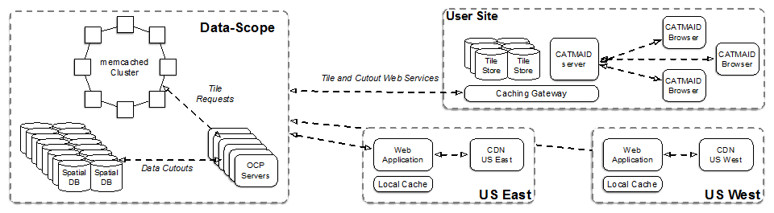
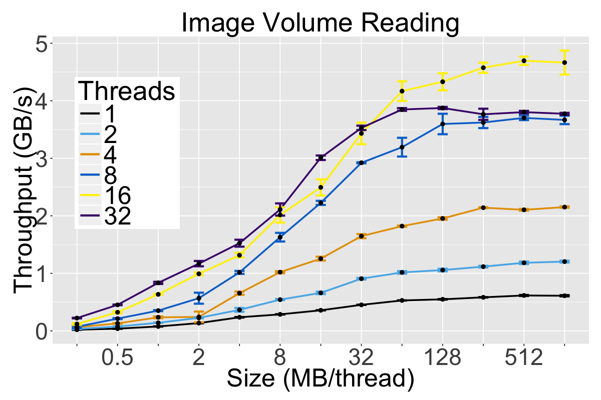
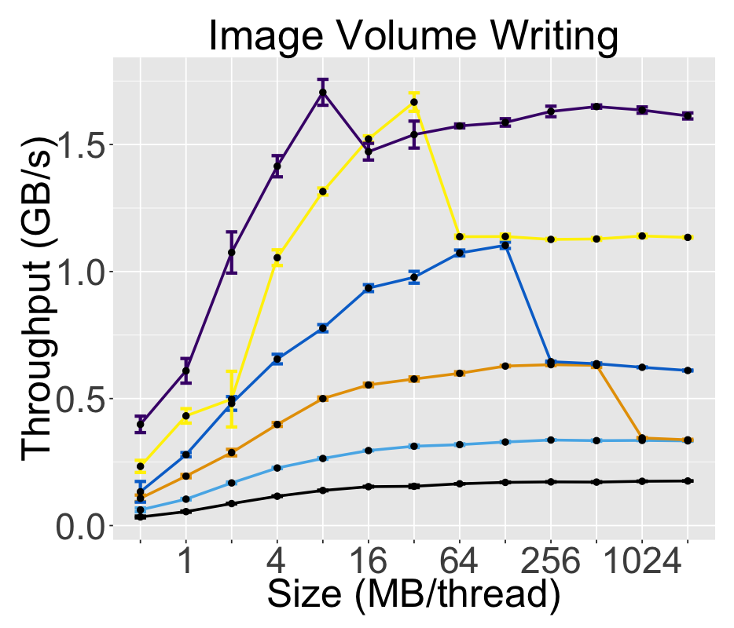

Scalable database cluster for the spatial analysis and annotation of high-throughput brain imaging data called Neurodata Web Services(formerly called the Open Connectome Project).

[](http://neurodata.io/)
[](http://dx.doi.org/10.5281/zenodo.19972)
[](http://www.apache.org/licenses/LICENSE-2.0.html)
[](http://docs.neurodata.io/ndstore/)
[](https://travis-ci.org/neurodata/ndstore)
[](http://neurodata.statuspage.io/)

Root directory of the cutout and annotation services.
Major directories include:

  * spdb -- [Spatial Database submodule](https://github.com/neurodata/spdb)
  * webservices -- Webservices module
  * ndproj -- Project Module
  * ramon -- RAMON and Annotation metadata module
  * django -- Django module
  * setup -- Setup instructions
  * test -- Test module
  * examples -- How to use the service
  * util -- Useful common files across the modules
  * ingest -- Scripts to insert datasets into the databases
  * admin -- Scripts to manage the databases
  * ndlib -- [Common library and Ctype accelerations submodule](https://github.com/neurodata/ndlib)
  * docs -- Sphinx documentation for the project
  * cython -- Cython acclerations for the service (Deprecated)
  * scripts -- Useful general purpose scripts
  * onetime -- Misc scripts for the service
  * NOTE: git submodule init and git submodule update for all submodules

#### Architecture



#### Installation

* Use a fresh Ubuntu14.04 instance with sudo access.
```console
wget https://raw.githubusercontent.com/neurodata/ndstore/master/setup/ndstore_install.sh
sudo chmod 7000 ndstore_install.sh
sudo ./ndstore_install.sh
```
**Note:** *ndstore does not support Docker images because running custom systemd services needs some relaxation of security on the Docker engine leading to issues. We recommend using the install script used above*

#### Benchmarks

The benchmarks were performed on AWS EC2 instance type i2.8xlarge with a MySQL backend.

##### Read Throughput



##### Write Throughput


