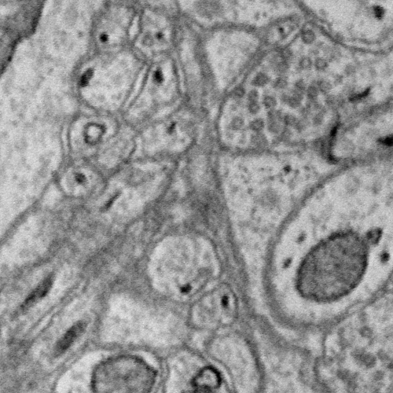
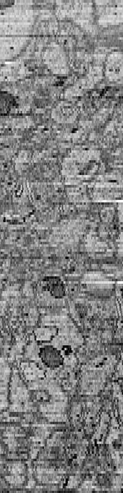

Slice APIS
**********

**NOTE**: These APIs do not return the orginal data. If you want the orginal raw data then please use the :ref:`Data APIs <data-api>`.

.. _slice-xy:

GET XY Slice Cutout
-------------------

.. http:get:: (string:server_name)/nd/ca/(string:token_name)/(string:channel_name)/xy/(int:resolution)/(int:min_x),(int:max_x)/(int:min_y),(int:max_y)/(int:z_slice)/(int:time_slice)/
   
   :synopsis: Download a single image of a specified canonical plane, XY, and specified channel, resolution and bounds. Your browser can load these images.

   :param server_name: Server Name in NeuroData. In the general case this is openconnecto.me.
   :type server_name: string
   :param token_name: Token Name in NeuroData.
   :type token_name: string
   :param channel_name: Channel Name in NeuroData. *Optional*. If missing will use default channel for the token.
   :type channel_name: string
   :param resolution: Resolution for the data
   :type resolution: int
   :param min_x: Minimum value in the xrange
   :type min_x: int
   :param max_x: Maximum value in the xrange
   :type max_x: int
   :param min_y: Minimum value in the yrange
   :type min_y: int
   :param max_y: Maximum value in the yrange
   :type max_y: int
   :param z_slice: Z-slice value
   :type z_slice: int
   :param time_slice: Minimum value in the timerange. *Optional*. Only used for timeseries channels.
   :type time_slice: int
    
   :statuscode 200: No error
   :statuscode 404: Error in the syntax or file format
   
   **Example Request**:
   
   .. sourcecode:: http
      
      GET /nd/ca/kasthuri11/image/xy/0/9000,9500/12000,12500/50/ HTTP/1.1
      Host: openconnecto.me

   **Example Response**:

   .. sourcecode:: http
      
      HTTP/1.1 200 OK
      Content-Type: image/tiff

.. _slice-xz:

GET XZ Slice Cutout
-------------------

.. http:get:: (string:server_name)/nd/ca/(string:token_name)/(string:channel_name)/xz/(int:resolution)/(int:min_x),(int:max_x)/(int:y_slice)/(int:min_z),(int:max_z)/(int:time_slice/
   
   :synopsis: Download a single image of a specified canonical plane, XZ, and specified channel, resolution and bounds. Your browser can load these images.

   :param server_name: Server Name in NeuroData. In the general case this is openconnecto.me.
   :type server_name: string
   :param token_name: Token Name in NeuroData.
   :type token_name: string
   :param channel_name: Channel Name in NeuroData. *Optional*. If missing will use default channel for the token.
   :type channel_name: string
   :param resolution: Resolution for the data
   :type resolution: int
   :param min_x: Minimum value in the xrange
   :type min_x: int
   :param max_x: Maximum value in the xrange
   :type max_x: int
   :param y_slice: Y-slice value
   :type y_slice: int
   :param min_z: Minimum value in the zrange
   :type min_z: int
   :param max_z: Maximum value in the zrange
   :type max_z: int
   :param time_slice: Minimum value in the timerange. *Optional*. Only used for timeseries channels.
   :type time_slice: int

   :statuscode 200: No error
   :statuscode 404: Error in the syntax or file format

   **Example Request**:
   
   .. sourcecode:: http
      
      GET /nd/ca/kasthuri11/image/xz/0/9000,9500/12000/50,250/ HTTP/1.1
      Host: openconnecto.me

   **Example Response**:

   .. sourcecode:: http
      
      HTTP/1.1 200 OK
      Content-Type: image/tiff

.. _slice-yz:

GET YZ Slice Cutout
-------------------

.. http:get:: (string:server_name)/nd/ca/(string:token_name)/(string:channel_name)/yz/(int:resolution)/(int:x_slice)/(int:min_y),(int:max_y)/(int:min_z),(int:max_z)/(int:time_slice)/
   
   :synopsis: Download a single image of a specified canonical plane, YZ, and specified channel, resolution and bounds. Your browser can load these images.

   :param server_name: Server Name in NeuroData. In the general case this is openconnecto.me.
   :type server_name: string
   :param token_name: Token Name in NeuroData.
   :type token_name: string
   :param channel_name: Channel Name in NeuroData. *Optional*. If missing will use default channel for the token.
   :type channel_name: string
   :param resolution: Resolution for the data
   :type resolution: int
   :param x_slice: X-slice value
   :type x_slice: int
   :param min_y: Minimum value in the yrange
   :type min_y: int
   :param max_y: Maximum value in the yrange
   :type max_y: int
   :param min_z: Minimum value in the zrange
   :type min_z: int
   :param max_z: Maximum value in the zrange
   :type max_z: int
   :param min_time: Minimum value in the timerange. *Optional*. Only used for timeseries channels.
   :type min_time: int
   :param max_time: Maximum value in the timerange. *Optional*. Only used for timeseries channels.
   :type max_time: int
    
   :form CUTOUT: HDF5 group, Post data
   :form CHANNELTYPE: HDF5 group, Channel type(image, annotation, probmap, timeseries)
   :form DATATYPE: HDF5 group, Data type(uint8, uint16, uint32, rgb32, rgb64, float32)

   :statuscode 200: No error
   :statuscode 404: Error in the syntax or file format
   
   **Example Request**:
   
   .. sourcecode:: http
      
      GET /nd/ca/kasthuri11/image/yz/0/9000/12000,12500/50,250/ HTTP/1.1
      Host: openconnecto.me

   **Example Response**:

   .. sourcecode:: http
      
      HTTP/1.1 200 OK
      Content-Type: image/tiff

.. figure:: ../images/slice_yz.png
    :align: center
    :width: 500px
    :height: 200px

JPEG Stack Service for KNOSSOS
==============================
 
.. _jpeg-get:

GET
----

.. http:get:: (string:server_name)/nd/ca/(string:token_name)/(string:channel_name)/jpeg/(int:resolution)/(int:min_x),(int:max_x)/(int:min_y),(int:max_y)/(int:min_z),(int:max_z)/
   
   :synopsis: Get a jpeg stack from the server in KNOSSOS format.

   :param server_name: Server Name in NeuroData. In the general case this is openconnecto.me.
   :type server_name: string
   :param token_name: Token Name in NeuroData.
   :type token_name: string
   :param channel_name: Channel Name in NeuroData. *Optional*. If missing will use default channel for the token.
   :type channel_name: string
   :param resolution: Resolution for the data
   :type resolution: int
   :param min_x: Minimum value in the xrange
   :type min_x: int
   :param max_x: Maximum value in the xrange
   :type max_x: int
   :param min_y: Minimum value in the yrange
   :type min_y: int
   :param max_y: Maximum value in the yrange
   :type max_y: int
   :param min_z: Minimum value in the zrange
   :type min_z: int
   :param max_z: Maximum value in the zrange
   :type max_z: int
    
   :statuscode 200: No error
   :statuscode 404: Error in the syntax or file format
   
   **Example Request**:
   
   .. sourcecode:: http
      
      GET /nd/ca/kasthuri11/image/jpeg/0/5000,5500/5000,5500/150,152/ HTTP/1.1
      Host: openconnecto.me

   **Example Response**:

   .. sourcecode:: http
      
      HTTP/1.1 200 OK
      Content-Type: image/jpeg

.. figure:: ../images/slice_jpeg.jpg
    :align: center
    :width: 500px
    :height: 1000px
