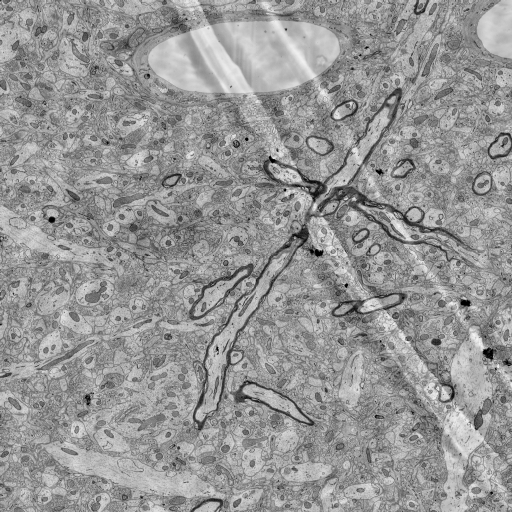
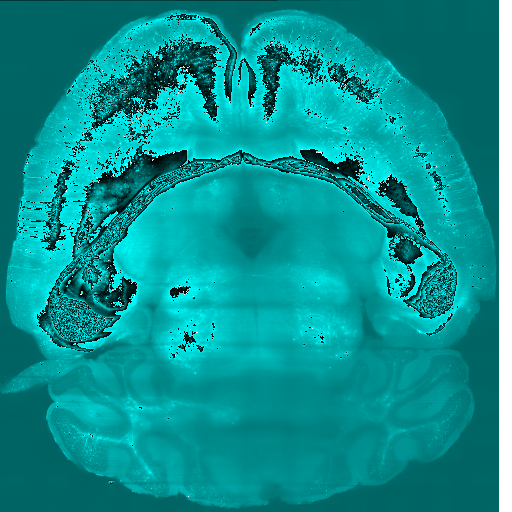
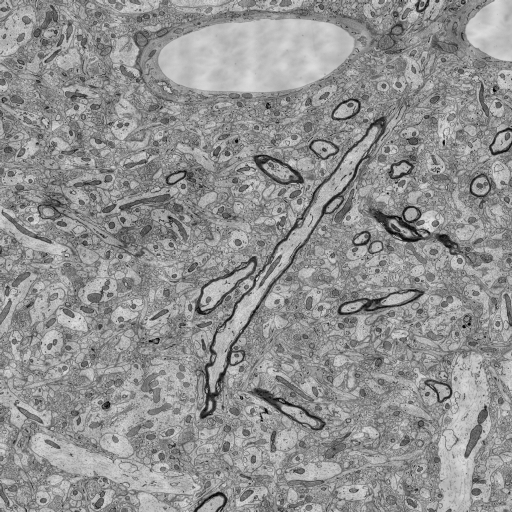

Tile APIs
**********

You can also view the `Tilecache APIs <http://docs.neurodata.io/ndtilecache/api/tilecache_api.html>`_ which work similarly for `ndtilecache <http://docs.neurodata.io/ndtilecache/index.html>`_.

**NOTE**: These APIs do not return the orginal data. If you want the orginal raw data then please use the :ref:`Data APIs <data-api>`.

.. _simple-tile:

getSimpleTile
-------------

.. http:get:: (string:server_name)/nd/catmaid/(string:token_name)/(string:channel_name)/(string:slice_type)/(int:time)/(int:zvalue)/(int:ytile)_(int:xtile)_(int:resolution).png
   
   :synopsis: Get a 512x512 tile from the database. This returns a simple Black and White tile.

   :param server_name: Server Name in NeuroData. In the general case this is openconnecto.me.
   :type server_name: string
   :param token_name: Token Name in NeuroData.
   :type token_name: string
   :param channel_name: Channel Name in NeuroData.
   :type channel_name: string
   :param slice_type: Type of Slice cutout. Can be xy/yz/xz
   :type slice_type: string
   :param time: Time value. *Optional*. Only possible in timeseries datasets.
   :type time: int
   :param zvalue: Zslice value.
   :type zvalue: int
   :param ytile: Y-Tile value. Each tile is 512x512.
   :type ytile: int
   :param xtile: X-Tile value. Each tile is 512x512.
   :type xtile: int
   :param resolution: Resolution value.
   :type resolution: int

   :statuscode 200: No error
   :statuscode 404: Error in the syntax or file format
   
   **Example Request**:
   
   .. sourcecode:: http
   
      GET  /nd/catmaid/kasthuri11/image/xy/1/1_1_4.png HTTP/1.1
      Host: openconnecto.me
   
   **Example Response**:
   
   .. sourcecode:: http 
      
      HTTP/1.1 200 OK
      Content-Type: application/png

.. _mcfc-tile:

getMcfcTile
-----------

.. http:get:: (string:server_name)/nd/catmaid/mcfc/(string:token_name)/(string:channel_name):(string:color_name)/(string:slice_type)/(int:time)/(int:zvalue)/(int:ytile)_(int:xtile)_(int:resolution).png
   
   :synopsis: Get a 512x512 color tile from the database. This returns a color tile based on the requested color.

   :param server_name: Server Name in NeuroData. In the general case this is openconnecto.me.
   :type server_name: string
   :param token_name: Token Name in NeuroData.
   :type token_name: string
   :param channel_name: Channel Name in NeuroData.
   :type channel_name: string
   :param color_name: Color Name. Can be 'C/M/Y/R/G/B'. *Optional* If Missing will default to "CMYRGB".
   :type color_name: string
   :param slice_type: Type of Slice cutout. Can be xy/yz/xz
   :type slice_type: string
   :param time: Time value. *Optional*. Only possible in timeseries datasets.
   :type time: int
   :param zvalue: Zslice value.
   :type zvalue: int
   :param ytile: Y-Tile value. Each tile is 512x512.
   :type ytile: int
   :param xtile: X-Tile value. Each tile is 512x512.
   :type xtile: int
   :param resolution: Resolution value.
   :type resolution: int

   :statuscode 200: No error
   :statuscode 404: Error in the syntax or file format

   **Example Request**:
   
   .. sourcecode:: http
   
      GET  /nd/catmaid/mcfc/Thy1eYFPBrain10/Grayscale/xy/500/0_0_3.png HTTP/1.1
      Host: openconnecto.me
   
   **Example Response**:
   
   .. sourcecode:: http 
      
      HTTP/1.1 200 OK
      Content-Type: application/png

.. _viking-tile:

getVikingTile
-------------

.. http:get:: (string:server_name)/nd/catmaid/viking/(string:token_name)/volume/(string:channel_name)/(int:resolution)/X(int:xtile)_Y(int:xtile)_Z(int:zvalue).png
   
   :synopsis: Get a 512x512 `Viking <https://connectomes.utah.edu/>`_ tile from the database

   :param server_name: Server Name in NeuroData. In the general case this is openconnecto.me.
   :type server_name: string
   :param token_name: Token Name in NeuroData.
   :type token_name: string
   :param channel_name: Channel Name in NeuroData.
   :type channel_name: string
   :param resolution: Resolution value.
   :type resolution: int
   :param xtile: X-Tile value. Each tile is 512x512.
   :type xtile: int
   :param ytile: Y-Tile value. Each tile is 512x512.
   :type ytile: int
   :param zvalue: Zslice value.
   :type zvalue: int

   :statuscode 200: No error
   :statuscode 404: Error in the syntax or file format
   
   **Example Request**:
   
   .. sourcecode:: http
   
      GET  /nd/catmaid/viking/kasthuri11/volume/image/4/X1_Y1_Z10.png HTTP/1.1
      Host: openconnecto.me
   
   **Example Response**:
   
   .. sourcecode:: http 
      
      HTTP/1.1 200 OK
      Content-Type: application/png

