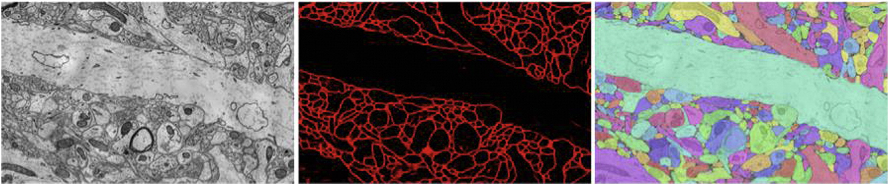

.. meta::
   :description: Official documentation for Open Connectome Project Web Services: Scalable database cluster for the spatial analysis and annotation of high-throughput brain imaging data
   :keywords: annotation, tracing, neuroscience, object detection
.. title::
   Open Connectome

.. raw:: html

	<h1>Open Connectome Project Web Services: Scalable database cluster for the spatial analysis and annotation of high-throughput brain imaging data</h1>
	 

OCP provides a scalable database cluster for the spatial analysis and annotation of high-throughput brain imaging data for 3-d electron microscopy image stacks, time-series and multi-channel data. The system is designed primarily for workloads that build connectomes---neural connectivity maps of the brain---using the parallel execution of computer vision algorithms on high-performance compute clusters. These services and open-science data sets are publicly available at ocp.me.

The system design inherits much from NoSQL scale-out and data-intensive computing architectures. We distribute data to cluster nodes by partitioning a spatial index. We direct I/O to different systems---reads to parallel disk arrays and writes to solid-state storage---to avoid I/O interference and maximize throughput. All programming interfaces are RESTful Web services, which are simple and stateless, improving scalability and usability. We include a performance evaluation of the production system, highlighting the effectiveness of spatial data organization.

    
    Spatially Registered Databases in the Open Connectome Project   

    Electron microscopy images of a mouse somatosensory cortex (left), a probability map output by a computer vision algorithm that detects membranes (center), and an annotation database that describes axons and dendrites (right).

.. raw:: html
 
  

    
    
     <a href="https://github.com/openconnectome/open-connectome/zipball/master"> [ZIP]   </a>  
    <a image="_static/GitHub.png" href="https://github.com/openconnectome/open-connectome/tarball/master">[TAR.GZ] </a>

  

.. sidebar:: OCP Contact Us 
   
   If you have questions about OCP, or have data to store, please let us know:  ocp-support@googlegroups.com
   
.. toctree::
   :maxdepth: 1
   :caption: Documentation

   sphinx/introduction
   sphinx/console
   sphinx/config
   sphinx/faq
   api/ocp_types
   api/info_api
   api/public_api
   api/data_api
   api/ramon_api
   api/propagate_api
   api/json_api
   api/overlay_api
   api/graphgen_api
   api/nifti_api
   api/swc_api

.. toctree::
   :maxdepth: 1
   :caption: Further Reading

   api/functions
   Gitter chatroom <https://gitter.im/openconnectome/open-connectome>
   Mailing List <https://groups.google.com/forum/#!forum/ocp-support/> 
   Github repo <https://github.com/openconnectome/open-connectome>
   Release Notes <https://github.com/openconnectome/open-connectome/releases/>

If you use OCP or its data derivatives, please cite:
  R Burns, K Lillaney, E Perlman, P Manavalan, JT Vogelstein (2015). ocp v0.7. Zenodo. 10.5281/zenodo.15974 `zenodo <https://zenodo.org/record/15974?ln=en#.VYyl-XUVhBc>`_ `bibtex <https://zenodo.org/record/15974?ln=en#.VYyjE3UVhBc>`_
  
  R Burns, K Lillaney, D R Berger, L Grosenick, K Deisseroth, R C Reid, W Gray Roncal, P Manavalan, D D Bock, N Kasthuri, M Kazhdan, S J Smith, D Kleissas, E Perlman, K Chung, N C Weiler, J Lichtman, A S Szalay, J T Vogelstein, and R J Vogelstein. The open connectome project data cluster: scalable analysis and vision for high-throughput neuroscience. SSDBM, 2013 `acm <http://dl.acm.org/citation.cfm?id=2484870>`_ `bibtex <http://dl.acm.org/citation.cfm?id=2484870>`_
