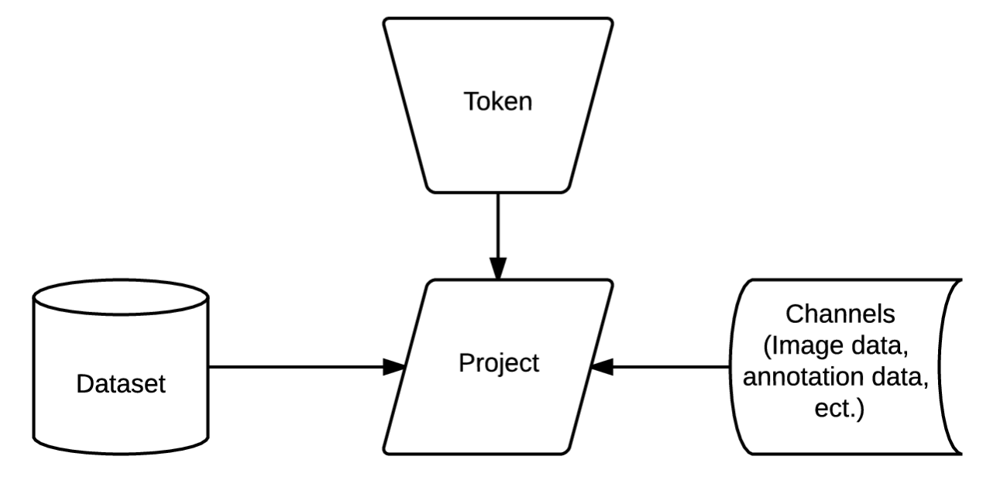

Adminstrator Console
********************

QuickStart
==========

To upload an image volume: Create a dataset with appropriate names/field values. Then, create a project from that dataset, with a channel of the image type that is being uploaded. Finally, create a token to access the project and use that token to upload the image data. The tutorials to do each of these steps is available below. Scripts for automated upload are available for python and Cajal (formerly ocpMatlab).

To upload annotation data: Using the existing project with the relevant image data create a channel of the annotation type that is being uploaded. Finally, create a token to access the project and use that token to upload the annotation data. The tutorials to do each of these steps is available below. More information on general annotation upload and download is available here.

Overview
========

The Console allows data to be uploaded and downloaded to OCP as well as access other services within OCP. Data in OCP is organized into datasets and projects, see below for a more extensive description of each. The diagram below shows how the overall service is organized;

	
Datasets are present on the OCP server and are accessed through projects. These datasets can hold multiple types of data, including image, annotation, ect. When a specific type of data needs to be accessed in a dataset (via the project), say for example 8-bit image data, a channel is created in the project for that specific datatype. The project (and in turn the channels and the dataset) is accessible by a token, which serves as an access point for anyone that has the token. 

Datasets
========

Overview
++++++++
Datasets contain all the current image/time datasets that the public has access to or any that have been created by the user. 

Tutorial
++++++++
Dataset Creation Tutorial

Projects
========

Overview
++++++++
Projects are what allow a user to access datasets as well as manipulate them in various ways, such as adding annotations of viewing datasets at a much lower resolution. Projects are organized into tokens and channels. Tokens allow a user, or many users, to access the project. Channels are the various data that are accessible by a certain project. For example a user might create a dataset and then wish to annotate it. The user would create a project and add (at least) two channels, one with annotation data and one with image data. Following this the user would create a token to allow themselves access to the project.
There also are cases where the user may wish to modify aspects of a project, whether that is the token or the channel. For example after doing the annotations in the above example a user may wish to share the annotations with the public, in which case they would modify the project to be public. However, to prevent data from getting modified unintentionally the user should also modify the channels to be read-only so data cannot be tampered with.

Tutorials
+++++++++

Project Creation Tutorial
Channel Creation Tutorial
Token Creation Tutorial

Dataset Creation Tutorial
=========================

Creating Dataset
++++++++++++++++
Navigate to the datasets drop down menu and select create dataset. Fill in the appropriate data fields for each line (a full explanation of each can be found below). Click create data set and you should be re-directed to the data set main page, where you will now see a new data set with the data you selected. To use the data set create a new project/token.

Data Fields
+++++++++++

+-------------------------+----------------------------------------------------------------------------------+
| Data Field              | Description                                                                      | 
+-------------------------+----------------------------------------------------------------------------------+
| Dataset Name            | The name of the data set you are uploading (Good practice is lastname and year). |
+-------------------------+----------------------------------------------------------------------------------+
| Description             | A description of the data being uploaded, good things to include may be species   and the location of where the images are from. 
+-------------------------+
X, Y, Z Image Size         This is the size of the X, Y, or Z plane 
X, Y, Z Offset             Amount to offset the X, Y, or Z plane 
PUBLIC                     Whether or not the template (not the data) is viewable by everyone using OCP 
Scaling Level              Sets the resolution level for the dataset (every additional number results in the resolution being halved). 
Scaling Options            0 - Normal, 1 - Isotropic 
X, Y, Z Voxel Resolution   This is the resolution of the data in each plane 
Start/End Time             For 4D data this is the start or end time, for any data that is not 4D leave the values at the default 0 

========================= ============================================================

Project Creation Tutorial
=========================

Creating/Managing a Project
+++++++++++++++++++++++++++
To create a project navigate to the datasets drop down menu and select create dataset. Fill in the appropriate data fields for each line (a full explanation of each can be found below). Click create data set and you should be re-directed to the data set main page, where you will now see a new data set with the data you selected. To use the data set create a new project/token.

To manage a project navigate to the projects dropdown menu and select view projects. To the right of the project you wish to modify select Update/Details and change the fields as desired.

Data Fields
+++++++++++

=========================  ==============================================================================================================================================================
Data Field                 Description
=========================  ==============================================================================================================================================================

Project Name               The is the name of the project.
Description                The description of the project. 
Public                     Whether or not the template is view-able to the public  
Dataset                    The dataset to be used by the project 
Database Host              Select which server you want the data to be stored on (This will be eliminated soon in favor of a new storage system). It is recommended you use the default. 
KV Engine                  The method of storing data (This will be eliminated soon as OCP moves to using cassandra exclusively).
KV Server                  This field will be removed soon, use the default.
Link to Existing Database  Use this option if the project is already present on OCP servers
Create a Default Token     Creates a default token for the project. 

=========================  ==============================================================================================================================================================

Channel Creation Tutorial
=========================

Creating/Managing a Channel
+++++++++++++++++++++++++++
If you have not created a project yet follow this tutorial. Then navigate to the projects drop down menu and select projects. Select the project you wish to create a channel for and select channel, then add channel. 

To modify a channel select the Update button in the channels menu.

Data Fields
+++++++++++

=========================  ==============================================================================================================================================================
Data Field                 Description
=========================  ==============================================================================================================================================================

Channel Name               The is the name of the channel.
Channel Type               The description of the channel. 
Datatype                   The data type being used by the channel.
Description                A description of the channel, usually containing data type and channel type information.
Read Only                  Whether or not the channel will allow modification. 
Resolution                 The resolution of the data.
Enable Exceptions          Enable annotations to overlap or not.
Propagate                  The status of propagation of the data.
Start Window               The lowest pixel value (defaults to 0). 
End Window                 The highest pixel value (defaults to 65536).
Set as Default Channel     Set as default channel for channel.

=========================  ==============================================================================================================================================================

Token Creation Tutorial
=========================

Creating/Managing a Channel
+++++++++++++++++++++++++++
If you have not created a project yet follow this tutorial. Then navigate to the projects drop down menu and select projects. Select the project you wish to create another token for and select tokens, then add token. To modify the token navigate to the tokens sub-menu again and select the modify option on the token you wish to edit. 

=========================  ==============================================================================================================================================================
Data Field                 Description
=========================  ==============================================================================================================================================================

Token                      Name of the token.
Description                A description of the token. 
Project                    The project to use.
Public                     Whether or the not the token is publicly viewable, which then allows people to access the channels of your project.

=========================  ==============================================================================================================================================================
