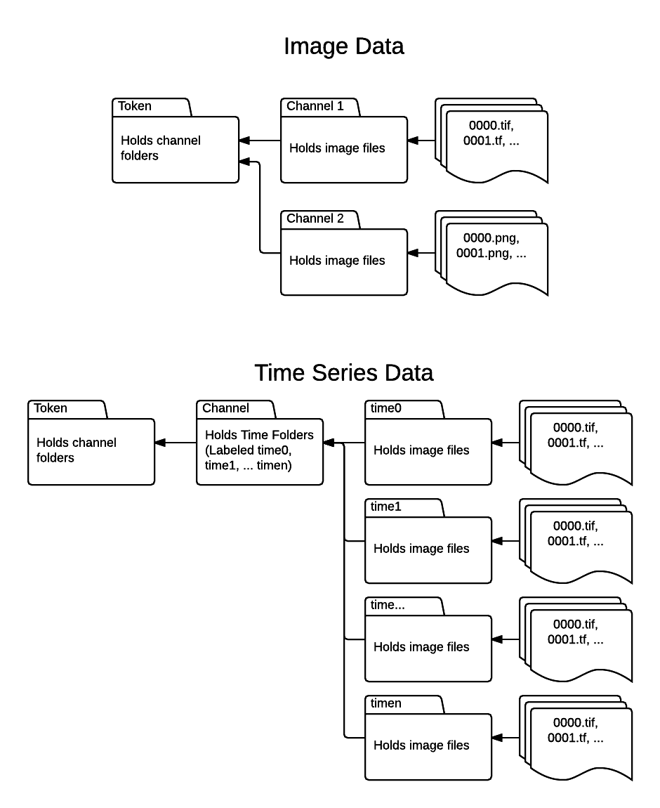

How to Ingest Data
******************

Prepping The Data
=================

There are two important components to how data should be organized before uploading to the service. First is file hierarchy (how the folders holding data should be organized) which is as follows; all channel specific data is saved in a folder with the name of the channel. For example if you have image data of two mouse cortices, one cortex would be stored in an image channel Cortex1. So, all the data from that imaging would be stored in a folder named Cortex1. In the case of time series data each channel folder should contain sub-folders time0, time1, time2, ..., timeN, each of which contains the image data for that specific time slot. All the channel folders should be stored inside a folder named the same as the token name.

Second is how the files themselves are organized. Currently the auto-ingest service only supports tiff, tif, and png files. The files should be organized such that there is a tiff/png/tif for each Z-slice, with each named the slice number up to 4 digits. For example if there was a imaging set with 405 image slices in tif form, the image channel folder(s) should have files labeled 0000.tif through 0404.tif. Files must not have a prefix or suffix to the number of the slice.

    This figure illustrated visually how the data should be organized for ingest.

Uploading
=========

Overview
++++++++

This section will initially address how to upload one channels worth of material. Located in the auto-ingest folder in the ingest folder of open-connectome is a file named generatejson.py (https://github.com/openconnectome/open-connectome/blob/master/ingest/autoingest/generatejson.py). To upload your data edit the hard-coded values in the code to reflect your data, being sure to specify that you are trying to put data to http://openconnecto.me and your DataURL is http accessible (if it is not the script will fail). Once the script has run you do not need to maintain a connection to the script. you can run the script simply by calling "python generatejson.py" on the script.

Explanation of Additional Terms
+++++++++++++++++++++++++++++++
The :ref:'data model <datamodel>' holds an explanation of the majority of the terms encountered when editing the generatejson.py script, however some extra terms that are not enumerated in that explanation are included here.

.. function:: Scaling

   Scaling is the orientation of the data being stored, 0 corresponds to a Z-slice orientation (as in a collection of tiff images in which each tiff is a slice on the z plane) and 1 corresponds to an isotropic orientation (in which each tiff is a slice on the y plane).

   :Type: INT
   :Default: 1

.. function:: Exceptions

   Exceptions is an option to enable the possibility for annotations to contradict each other (assign different values to the same point). 1 corresponds to True, 0 corresponds to False.

   :Type: INT
   :Default: 0

.. function:: Read Only

   This option allows the user to control if, after the initial data commit, the channel is read-only. Generally this is suggested with data that will be publicly viewable. 1 corresponds to True, 0 corresponds to False.

   :Type: INT
   :Default: 0

.. function:: Data URL

   This url points to the root directory of the files. Dropbox (or any data requiring authentication to download such as s3) is not an acceptable HTTP Server.

   :Type: AlphaNumeric
   :Default: None
   :Example: http://ExampleServer.University.edu/MyData/UploadData/

.. function:: File Format

   File format refers to the overarching kind of data, as in slices (normal image data) or catmaid (tile-based).

   :Type: {SLICE, CATMAID}
   :Default: None
   :Example: SLICE

.. function:: File Type

   File type refers to the specific type of file that the data is stored in, as in, tiff, png, or tif.

   :Type: AlphaNumeric
   :Default: None
   :Example: tiff

Unsupported Image Types
=======================

We currently do not support 3-D tiffs.
